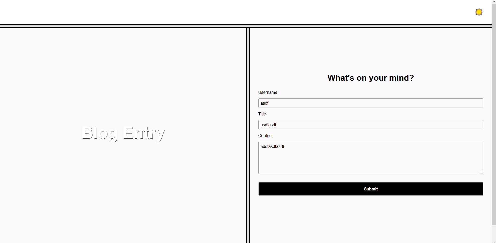
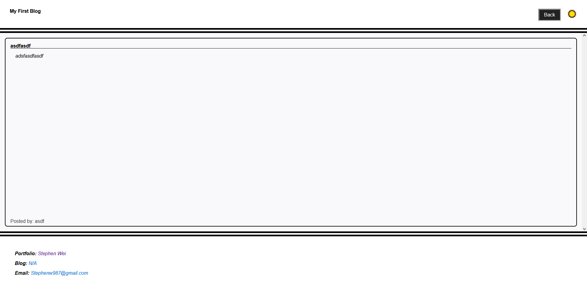

# Personal_Blog-Challenge04

## Description

This is a 2-page personal blog to demonstrate user input and viewing of inputted content. It consists of a form for inputting content, that is stored on in localstorage. This can later be viewed on the second blog page. there is also a light/dark mode toggle.

## Usage

This application is meant to create a personal blog to showcase my thoughts and experiences. It will be composed of 2 pages where one is a form for inputting content and a second presents it from local storage in blog format after the "submit" button is clicked. 

## License

MIT License

Copyright (c) [2024] [Stephen Wei]

Permission is hereby granted, free of charge, to any person obtaining a copy
of this software and associated documentation files (the "Software"), to deal
in the Software without restriction, including without limitation the rights
to use, copy, modify, merge, publish, distribute, sublicense, and/or sell
copies of the Software, and to permit persons to whom the Software is
furnished to do so, subject to the following conditions:

The above copyright notice and this permission notice shall be included in all
copies or substantial portions of the Software.

THE SOFTWARE IS PROVIDED "AS IS", WITHOUT WARRANTY OF ANY KIND, EXPRESS OR
IMPLIED, INCLUDING BUT NOT LIMITED TO THE WARRANTIES OF MERCHANTABILITY,
FITNESS FOR A PARTICULAR PURPOSE AND NONINFRINGEMENT. IN NO EVENT SHALL THE
AUTHORS OR COPYRIGHT HOLDERS BE LIABLE FOR ANY CLAIM, DAMAGES OR OTHER
LIABILITY, WHETHER IN AN ACTION OF CONTRACT, TORT OR OTHERWISE, ARISING FROM,
OUT OF OR IN CONNECTION WITH THE SOFTWARE OR THE USE OR OTHER DEALINGS IN THE
SOFTWARE.